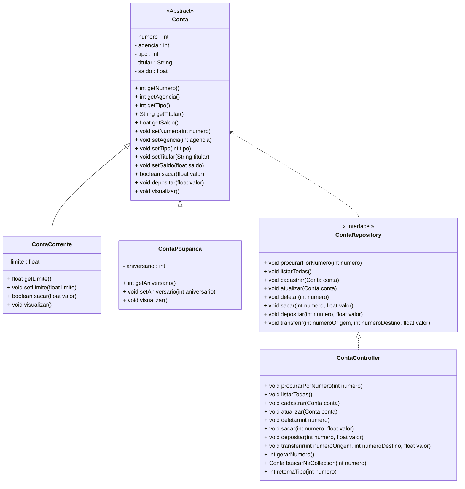

<h1 align="center">
    <a href="[https://www.java.com/pt-BR/]/">🔗 Projeto feito em Java </a>
</h1>

Este projeto foi feito durante o primeiro bloco do bootcamp da Generation. Nesta fase tive contato com o paradigma de Orientação a Objetos e pela primeria vez pude colocar em prática o CRUD (Create, Read, Update e Delete).  

<h4 align="center"> 
	
  
</h4>

***

### 📌 O Projeto é composto pelas seguintes Classes e Interfaces:

| Classe/Interface    | Descrição                                                    |
| ------------------- | ------------------------------------------------------------ |
| **Menu**            | Classe principal, que conterá o Método main, responsável por criar o Menu inicial da aplicação com todas as funcionalidades do sistema. |
| **Cores**           | Classe utilitária, que possui a função de aplicar cores ao Menu. |
| **Conta**           | Classe responsável por definir o Objeto Conta genérico.      |
| **ContaCorrente**   | Classe responsável por definir o Objeto Conta Corrente.      |
| **ContaPoupanca**   | Classe responsável por definir o Objeto Conta Poupanca.      |
| **ContaRepository** | Interface responsável por encapsular os Métodos que serão utilizados no Menu da aplicação |
| **ContaController** | Classe responsável por implementar a Interface ContaRepository. |

***

### 📝 Diagrama de Classes do Projeto Conta Bancária (DER) 

***

### 🔨 Características e Funcionalidades:
- [x] Classe de utilidades: com cores;
- [x] Classe abstrata;
- [x] Execptions
- [x] Métodos CRUD;
- [x] Métodos Bancários;

***

### 🎯 Como executar o sistema?
   1) Você pode baixar este repositório e exectuar na sua máquina
   2) Ou você pode executar sem baixar, basta acessar meu [**Replit:**](https://replit.com/@JayCesar/ContaBancaria?v=1) e clicar em **"Run"**;

***

### ▶️ Breve demonstração
